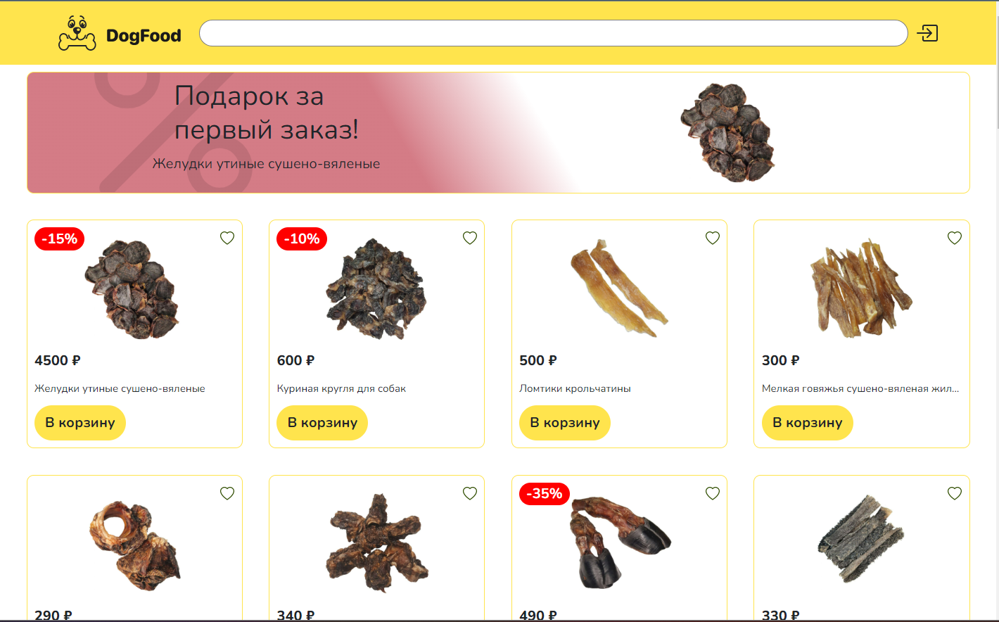
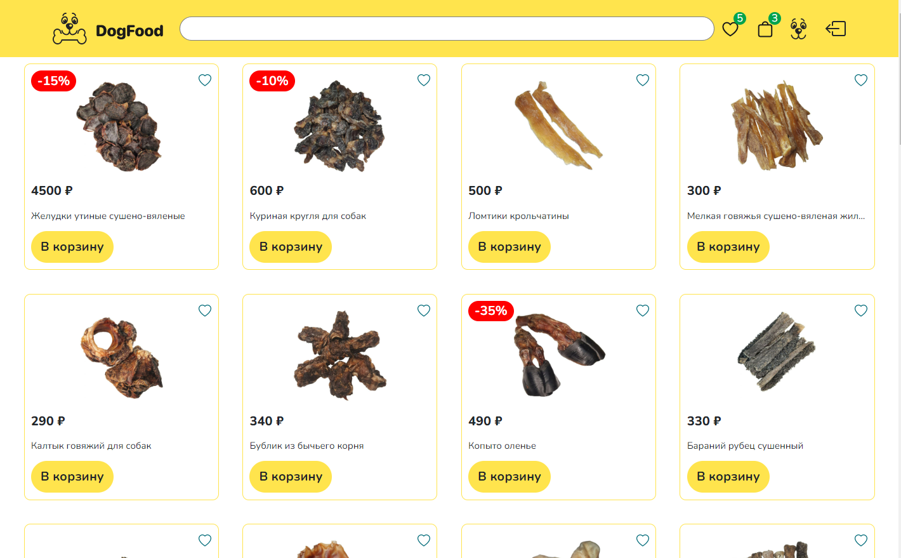
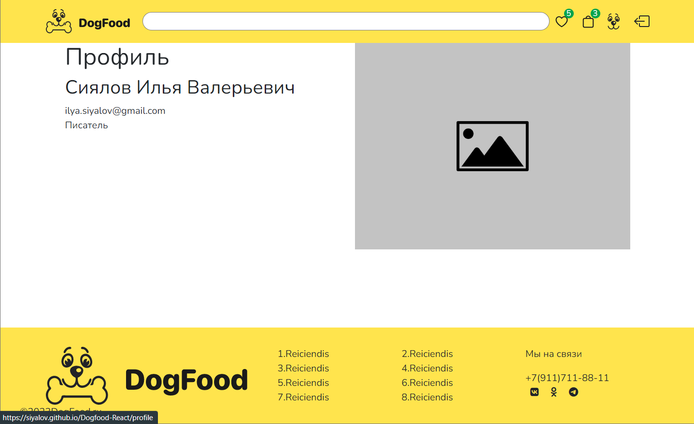
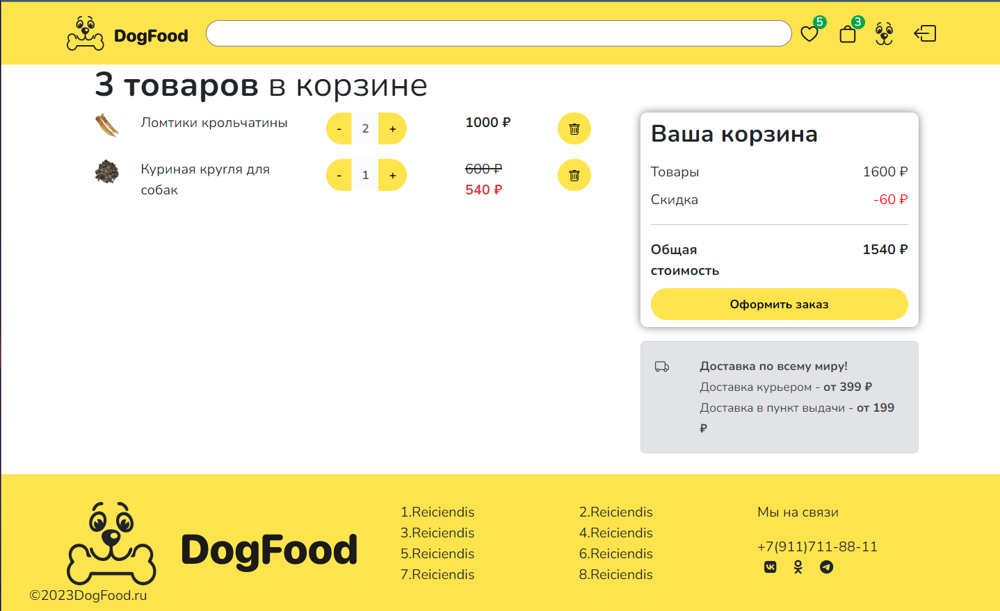
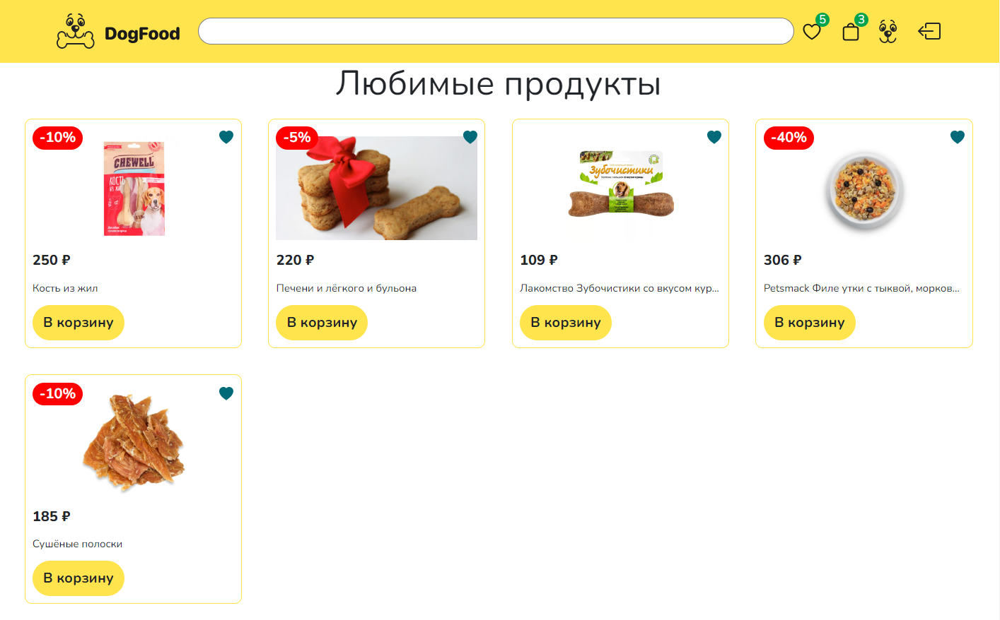
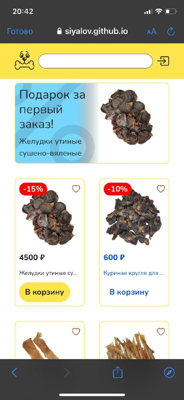
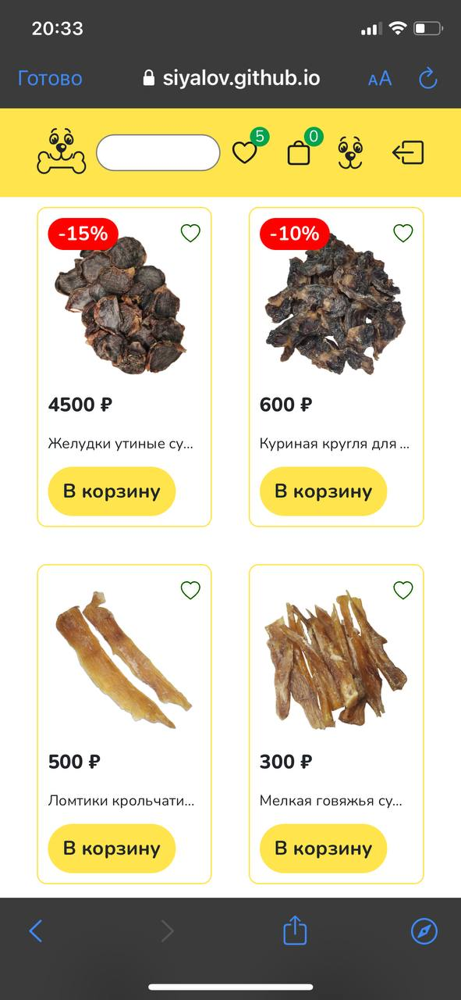
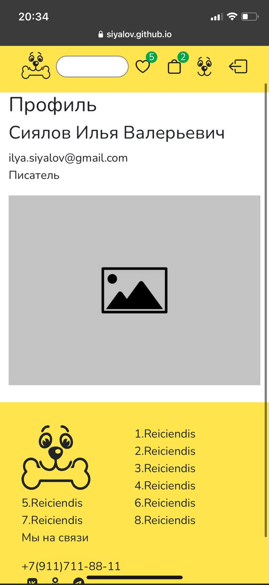
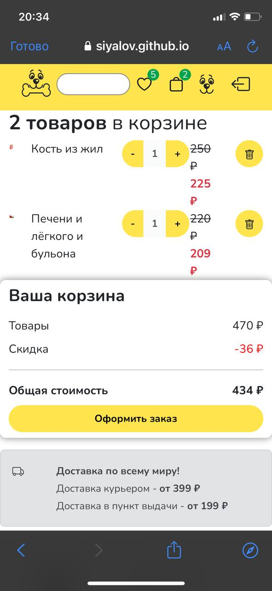
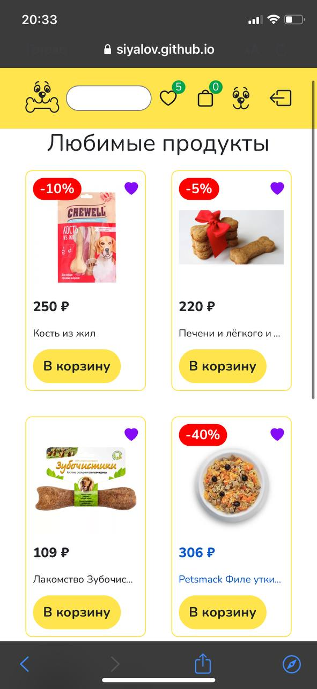

# Simple React Template

## Проект на гитхабе: https://siyalov.github.io/Dogfood-React/


Для успешной работы с проектом необходимо выполнить следующие действия:

1. Установить [Node.js](https://nodejs.org/en/)
1. Скачать и распаковать проект
1. Открыть терминал и установить курсор терминала в папке с проектом
1. Установить зависимости node_modules
    * При наличии прав администратора
        ```bash
        npm install -g yarn
        yarn install
        ```

    * Без прав администратора
        ```bash
        npm install
        ```

1. Запустить проект
    ```bash
    npm start
    ```
## Скриншоты:

### Реклама (если user не авторизирован)


### Товары



### Профиль


### Корзина


### Любимые продукты


### Мобильная версия реклама (если user не авторизирован)


### Мобильная версия (Товары) 


### Мобильная версия (Профиль) 


### Мобильная версия (Корзина) 


### Мобильная версия (Любимые продукты)

